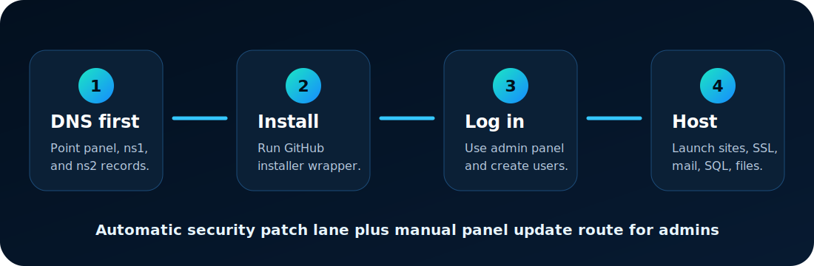
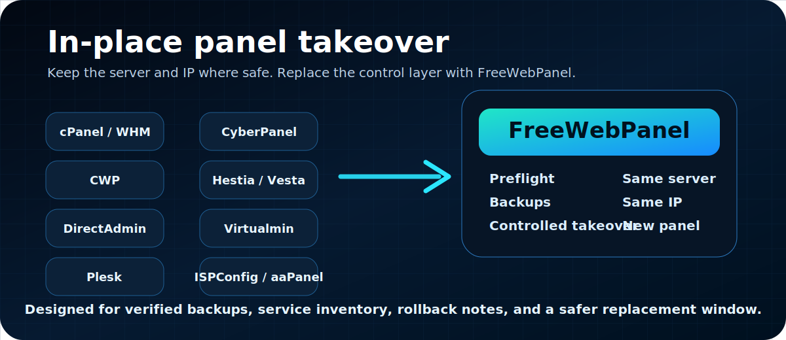

# FreeWebPanel


[](https://freewebpanel.com/)
[](#quick-install)
[](docs/INSTALL.md)
[](docs/LICENSING_AND_PROTECTION.md)
[](docs/VIDEOS.md)

**FreeWebPanel Free Core** is the public entry point for a real Linux hosting business: install on a clean Ubuntu server, create hosting accounts, publish websites, manage mail, SQL, files, domains, SSL, security, backups, updates, and customer workspaces, then grow into official Pro or support when the server starts earning.

This GitHub repository is the public front door for installs, documentation, videos, and safe project discovery. The official release bundle, update channel, Pro licensing, paid support, commercial response, and protected runtime assets are served from [freewebpanel.com](https://freewebpanel.com/).

## Why FreeWebPanel Exists

Hosting should not start with a license bill before a server has customers. FreeWebPanel gives server owners and hosting providers a clean Free Core path first:

- Install on a clean server.
- Create hosting accounts and customer workspaces.
- Launch real websites with DNS, SSL, files, email, SQL, and backups.
- Keep security updates moving without paying extra for basic patch flow.
- Add official Pro/support when the server is ready for serious commercial use.

## Quick Install

Use a clean Ubuntu 24.04 LTS server with a DNS-only hostname pointed at the server IP.

```bash
curl -fsSL https://raw.githubusercontent.com/ResearchForumOnline/FreeWebPanel/main/install.sh | sudo bash -s -- \
  --hostname panel.example.com \
  --email admin@example.com \
  --server-profile provider
```

After installation:

- Admin panel: `https://panel.example.com:2087/admin/login`
- User panel: `https://panel.example.com:2083/user/login`
- Credentials file on the server: `/root/THCZ_PANEL_CREDENTIALS.txt`



Full install guide: [docs/INSTALL.md](docs/INSTALL.md)

## What Free Core Includes

| Area | Included |
| --- | --- |
| Accounts | Hosting account creation, customer workspaces, admin/user panels |
| Websites | Document roots, site launch checks, file manager, upload, edit, move, delete, extract |
| Domains | DNS records, aliases, subdomains, nameserver guidance, AutoSSL and redirects |
| Mail | Mailboxes, forwards, webmail launchers, SPF/DKIM/DMARC-style deliverability checks |
| SQL | Database workflows, users, phpMyAdmin/Adminer launcher flow |
| Security | Guarded file writes, firewall guidance, lockout safety, service checks, update lane |
| Updates | Automatic FreeWebPanel core checks plus manual admin update route |
| Themes | Light, Dark, Midnight, and official compiled runtime panel themes |
| Growth | Free Core first, official Pro/support when the hosting business needs it |

Feature map: [docs/FEATURE_MAP.md](docs/FEATURE_MAP.md)

## Featured Videos

### FreeWebPanel Explained Easy Hosting

[](https://www.youtube.com/watch?v=XmHH54gGl4Y)

### Breaking The License Gap by FreeWebPanel.com

[](https://www.youtube.com/watch?v=c6qEJ0vpMf4)

More media and future video ideas: [docs/VIDEOS.md](docs/VIDEOS.md)

## Install Lanes

1. **Ubuntu 24.04 LTS** - production install lane.
2. **AlmaLinux / RockyLinux / RHEL-family** - preflight validation today, RPM/dnf lane planned.
3. **ZeroMint AIOS / OpenZero AIOS** - compatibility wrapper for AIOS servers.
4. **Existing panel replacement** - preflight and guarded takeover planning for hosts moving away from legacy panels.

## In-Place Panel Takeover



FreeWebPanel is built for hosts that want a stronger control panel without rebuilding the whole server estate. The takeover path is designed to keep the same server and public IP where the current server state allows it, then replace the old panel workflow with FreeWebPanel accounts, domains, DNS, SSL, file manager, mail, SQL, backups, security checks, and updates.

Start here: [docs/migrations/README.md](docs/migrations/README.md)

Panel-specific takeover guides:

- [cPanel / WHM to FreeWebPanel](docs/migrations/cpanel-whm-to-freewebpanel.md)
- [Control Web Panel / CWP to FreeWebPanel](docs/migrations/control-web-panel-cwp-to-freewebpanel.md)
- [DirectAdmin to FreeWebPanel](docs/migrations/directadmin-to-freewebpanel.md)
- [Plesk to FreeWebPanel](docs/migrations/plesk-to-freewebpanel.md)
- [CyberPanel to FreeWebPanel](docs/migrations/cyberpanel-to-freewebpanel.md)
- [HestiaCP / VestaCP to FreeWebPanel](docs/migrations/hestia-vesta-to-freewebpanel.md)
- [Webmin / Virtualmin to FreeWebPanel](docs/migrations/webmin-virtualmin-to-freewebpanel.md)
- [ISPConfig to FreeWebPanel](docs/migrations/ispconfig-to-freewebpanel.md)
- [aaPanel to FreeWebPanel](docs/migrations/aapanel-to-freewebpanel.md)
- [Generic panel takeover](docs/migrations/generic-panel-takeover.md)

Takeover always starts with preflight and verified off-server backups. FreeWebPanel should stop for operator review when it cannot safely map a service.

## DNS Before Install

Create DNS-only A records before running the installer:

```text
panel.example.com      -> your server IPv4
ns1.panel.example.com  -> your server IPv4
ns2.panel.example.com  -> your server IPv4
```

If using Cloudflare, keep these records **DNS only / grey cloud**. Do not proxy the panel hostname or nameserver hostnames.

## Official Links

- Website: [https://freewebpanel.com/](https://freewebpanel.com/)
- GitHub: [https://github.com/ResearchForumOnline/FreeWebPanel](https://github.com/ResearchForumOnline/FreeWebPanel)
- Videos: [https://www.youtube.com/@quantumzero101/videos](https://www.youtube.com/@quantumzero101/videos)
- TalkToAI: [https://talktoai.org/](https://talktoai.org/)
- OpenZero AIOS: [https://openzero.talktoai.org/](https://openzero.talktoai.org/)
- Project links: [docs/PROJECT_LINKS.md](docs/PROJECT_LINKS.md)

## Free, Pro, And Official Licensing

Free Core is public and installable from GitHub. Pro features, official licensing, paid support, branded releases, update signing, and commercial support are controlled by [freewebpanel.com](https://freewebpanel.com/).

Only FreeWebPanel.com is authorised to sell official FreeWebPanel licenses, Pro access, hosted update services, and support. Hosting providers can use Free Core on their own servers, but they may not sell unofficial FreeWebPanel licenses or represent themselves as the official vendor.

The public installer does not publish private theme source. Installed servers receive compiled/minified runtime assets only. See [docs/THEME_ASSET_PROTECTION.md](docs/THEME_ASSET_PROTECTION.md) and [docs/LICENSING_AND_PROTECTION.md](docs/LICENSING_AND_PROTECTION.md).

## GitHub Maintainer Setup

For project maintainers who want cleaner local pushes, signed commits, and SSH remotes, see:

[docs/GITHUB_AUTH_SETUP.md](docs/GITHUB_AUTH_SETUP.md)

## Security

FreeWebPanel is a hosting control panel and should be installed only on a clean server you control. Do not run public install commands on a production host until you have backups and have reviewed the flags you are using.

Security reports: [SECURITY.md](SECURITY.md)

## Repository Boundary

This repo is intentionally public and useful, but it is not a dump of hidden production assets. It can include install wrappers, public docs, public diagrams, issue templates, and Free Core material. It should not include private Pro modules, private theme source, source maps, signing keys, license server internals, billing logic, customer data, server credentials, or hidden admin automation.

## License

Free Core is distributed under the Apache License 2.0. FreeWebPanel names, logos, official service marks, Pro modules, paid licensing flows, update signing keys, commercial support channels, and official theme trade dress are not granted by the Apache license.
